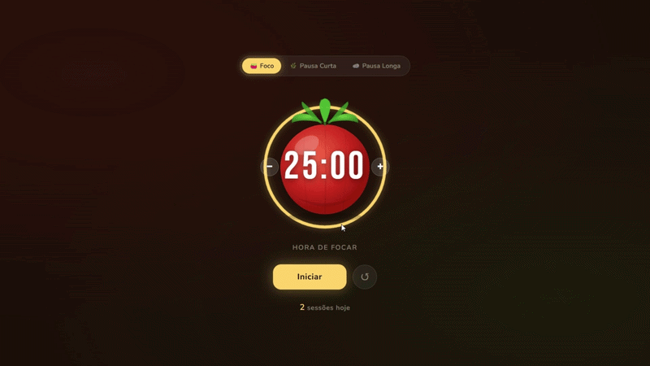

# 🍅 Pomodoro Timer

> Terceiro projeto da série **Um projeto por dia** — construído com HTML, CSS e JavaScript puro.

---

## 🔥 Funcionalidades

- 3 modos: **Foco** (25min), **Pausa Curta** (5min) e **Pausa Longa** (15min)
- Tomate ilustrado em SVG com gradiente e reflexo de luz
- Anel de progresso animado ao redor do tomate
- Ajuste de tempo com botões **+** e **−**
- Iniciar, pausar e resetar o timer
- Som de notificação ao finalizar
- Contador de sessões concluídas
- Cores do tema mudam conforme o modo ativo

---

## 🛠 Tecnologias

---

## 💡 O que aprendi

- `setInterval` e `clearInterval` para controle de tempo
- SVG com `stroke-dashoffset` para o anel de progresso
- `radialGradient` em SVG para efeito de volume 3D
- Web Audio API para gerar som sem arquivos externos
- Troca de temas via CSS variables

---

Feito por <a href="https://github.com/biacarollin">biacarollin</a> 🖤

